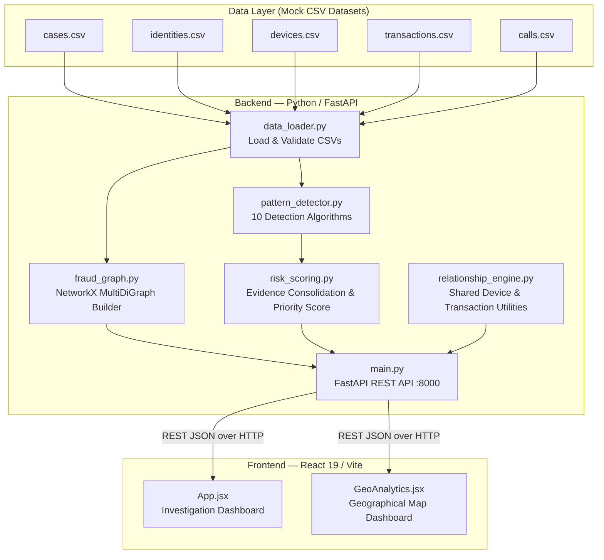

# Architecture

## System Architecture



## Components

| Component | Technology | Responsibility |
|---|---|---|
| Data Layer | CSV files (5 datasets) | Mock cyber-fraud case records — cases, identities, devices, transactions, calls |
| Data Loader | Python / pandas | Load, validate column schema, and type-clean all 5 CSV datasets |
| Graph Engine | Python / NetworkX `MultiDiGraph` | Build a per-case relationship graph connecting all entity types |
| Pattern Detector | Python | 10 independent behavioral signal detectors (fan-out, layering, cycles, OTP relay, spoof, etc.) |
| Risk Scoring Engine | Python | Consolidate raw findings, apply weighted scoring, produce priority band (LOW → CRITICAL) |
| Relationship Engine | Python / pandas | Standalone utility for shared-device and transaction relationship queries |
| REST API | FastAPI + Uvicorn | Expose all investigation data as JSON endpoints; CORS-enabled for local frontend |
| Investigation Dashboard | React 19 + ReactFlow 11 + Vite 8 | Interactive fraud network graph, evidence panel, hierarchy view, case brief |

## Data Flow

1. **CSV ingestion** — `data_loader.py` reads all 5 CSVs from `src/backend/data/raw/`, validates required columns, and applies type coercions (booleans, numerics, timestamps).
2. **Graph construction** — `fraud_graph.py` filters each dataset to the requested `case_id` and builds a `NetworkX MultiDiGraph` with node types: `case`, `identity`, `account`, `phone`, `device`, `transaction`, `call`. Edges encode relationships such as `contains_identity`, `owns_account`, `sent_transaction`, `made_call`, `originated_on`, etc.
3. **Pattern detection** — `pattern_detector.py` runs 10 independent detectors against the case data. Each returns a list of structured `findings` dicts with `pattern_type`, `severity`, `entities`, `evidence`, and `description`. No ground-truth fraud labels are used.
4. **Evidence consolidation & scoring** — `risk_scoring.py` deduplicates raw findings (keeps longest layering chain, aggregates device/identity signals, deduplicates loops), applies per-category signal weights (max 100 pts), and assigns a priority band.
5. **API response** — `main.py` assembles graph nodes/edges + score + hierarchy + evidence into JSON-safe responses via `make_json_safe()` and serves them over FastAPI endpoints.
6. **Frontend rendering** — `App.jsx` fetches `/cases/{id}/brief-data` and `/cases/{id}/network` in parallel, normalises the response, and renders: a ReactFlow fraud network graph (7 node-type layers), a clickable evidence panel that highlights related graph nodes, a Kingpin → Mule → Victim hierarchy grid, and a case brief summary.

## Node & Edge Schema

```
CASE
 ├── contains_identity ──► IDENTITY
 │                              ├── has_phone ──► PHONE
 │                              │                   ├── made_call ──► CALL ──► received_call ──► PHONE
 │                              │                   └── call ──► PHONE  (direct communication edge)
 │                              ├── owns_account ──► ACCOUNT
 │                              │                       ├── sent_transaction ──► TRANSACTION
 │                              │                       │                            ├── received_by ──► ACCOUNT
 │                              │                       │                            └── originated_on ──► DEVICE
 │                              │                       └── transaction ──► ACCOUNT  (direct money-flow edge)
 │                              └── uses_device ──► DEVICE
 │                                                      └── ◄── used_device (from CALL)
```

## Investigation Score Weights

| Signal | Weight | Category Cap |
|---|---|---|
| Shared Device | 15 | 15 |
| OTP Relay Signal | 15 | 15 |
| Caller ID Spoof Signal | 15 | 15 |
| Transaction Cycle | 15 | 15 |
| Fan-Out Distribution | 12 | 12 |
| Layering Chain | 12 | 12 |
| Risk-Flagged Devices | 6 | 12 |
| Prior Fraud Flag | 6 | 6 |
| Communication Loop | 5 | 10 |
| New Beneficiary | 3 | 9 |
| **Total cap** | | **100** |

Priority bands: `CRITICAL` ≥ 60 · `HIGH` ≥ 40 · `MEDIUM` ≥ 20 · `LOW` < 20

## API Endpoints

| Method | Endpoint | Description |
|---|---|---|
| GET | `/` | Health / service info |
| GET | `/health` | Cases loaded count |
| GET | `/cases` | All cases list |
| GET | `/cases/{id}` | Full case data (identities, devices, transactions, calls) |
| GET | `/cases/{id}/network` | NetworkX graph as nodes + edges JSON |
| GET | `/cases/{id}/risk` | Investigation score summary |
| GET | `/cases/{id}/alerts` | Top alerts with priority band |
| GET | `/cases/{id}/hierarchy` | Kingpin → Mule → Victim identity list |
| GET | `/cases/{id}/brief-data` | Composite: score + network + hierarchy + evidence |

## Security Considerations

- API keys and credentials are stored in environment variables via `.env` — never committed to git (`.gitignore` enforced)
- The investigation score is derived exclusively from behavioral signals — ground-truth labels (`is_fraudulent`, `pattern_type`) are explicitly excluded from scoring to prevent circular reasoning
- All data in this prototype is **synthetic mock data** — no real PII or financial records are used
- A legal disclaimer is surfaced on every case brief: *"This output contains synthetic investigative signals derived from mock case records. It does not establish fraud, guilt, or criminal responsibility."*
- CORS is restricted to `localhost:5173` (Vite dev server) in the current configuration

## Scalability Notes

- The FastAPI backend is stateless — each request reloads the CSVs. In production, this would be replaced by a database-backed layer (PostgreSQL or a graph database such as Neo4j) with a connection pool.
- The NetworkX graph is built per-request. For large case networks, pre-built graph snapshots cached in Redis would reduce latency.
- The pattern detection algorithms are independent of each other and can be parallelised trivially using `concurrent.futures`.
- The React frontend uses `useMemo` for graph node/edge computation to avoid redundant re-renders on evidence focus changes.
- The geo analytics endpoint aggregates across all cases in a single pass — suitable for the current dataset size; a materialized view would be needed at scale.
